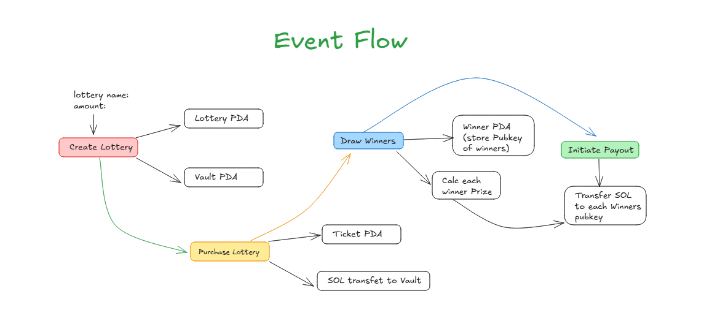
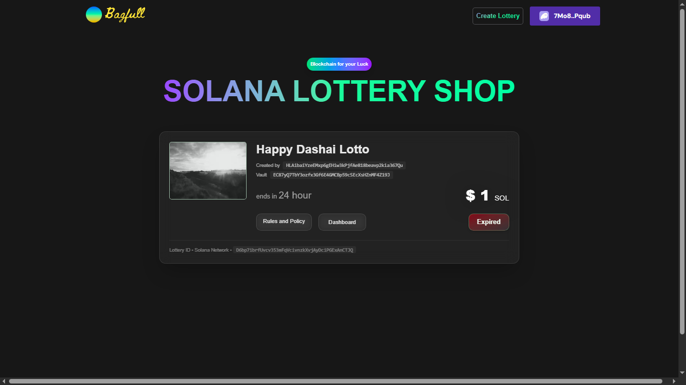
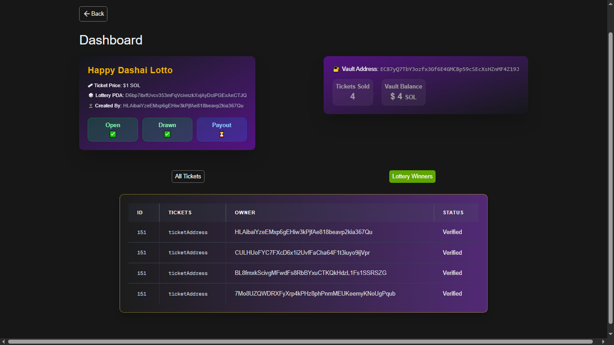
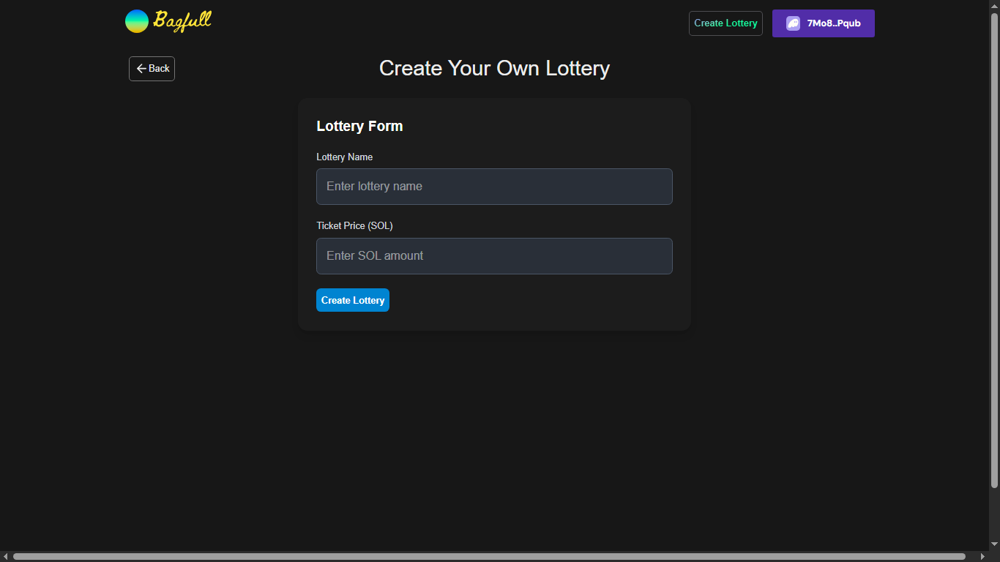

# Bagfull 

A decentralized lottery app built on **Solana + Anchor**, designed to be simple, transparent, and fair.  

 [Live Demo](#) - https://bagfull-next.vercel.app/  
 
 [Smart Contract](#) - https://github.com/kshitijbhusal/bagfull-smartcontract
 
 [3-Minute Video Demo](#) - https://youtu.be/7ysQw-Tn5HI 
 
 [Program ID](#) - `FvMmdRs922eAkmVXtWN3oJSaBdYYSL6WYvqHR8xbL4wC`

---

##  Problem Statement  

Traditional lotteries often suffer from **lack of transparency**, **trust issues**, and **slow payouts**.  
People participate without knowing if the system is truly fair—or if it’s even winnable.  

---

##  Solution  

**Bagfull** brings the lottery experience on-chain:  
- Every ticket purchase, vault, and winner selection is recorded on Solana.  
- No middlemen, no shady practices.  
- Just code, math, and chance—open for anyone to verify.  

---

##  Business Potential  

- **Global Reach**: Anyone with an internet connection and wallet can participate.  
- **Low Costs**: Built on Solana’s low-fee ecosystem, making micro-lotteries possible.  
- **Scalable Model**: Could expand into raffles, community-driven prize pools, or even NFT-based lotteries.  

---
##  Event Flow

---
##  Logic / Math  

The winning system is designed to be **simple and fair**:  

1. **Total Participants** = `N`  
2. **Number of Winners** = `25% of N`  
   - Example: If 50 people participate → 12 winners (rounded down).  
3. **Total Prize Pool (Vault)** = Sum of all ticket purchases.  
4. **Payout per Winner** =  `Total Prize Pool / 25% of N`

### Example  

- Total Participants: **50**  
- Vault Value: **2 SOL**  
- Winners: **25% of 50 = 12**  
- Payout per Winner: **2 x 50 ÷ 12 = 8.33 SOL each**  

So, in this case, **12 winners** would each get **8.33 SOL**.  

---

##  Key Features  

-  **Buy Tickets** with SOL in just a few clicks.  
-  **Secure Vaults** for storing prize pools.  
-  **Provably Fair Winner Selection** (no manual interference).  
-  **On-chain Records** so anyone can verify results.  
-  **Fast & Cheap Transactions** powered by Solana.  

---

- Tech Stack: Solana, Anchor, Next.js, TypeScript  

---

## Screenshots

## Screenshots

